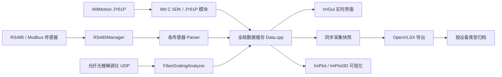

# ZJU_Oil

面向油气管道、岸坡沉降与多源结构响应监测的 Windows 上位机工程。项目以 C++17 为主体，基于 Dear ImGui 构建交互界面，集成 RS485/Modbus、UDP、Excel 数据读写、二维/三维曲线展示和多传感器同步采集能力，用于实验现场的传感器接入、实时监看、同步记录与后处理数据整理。

> 本说明根据仓库现有源码、工程文件和协议资料整理，适合作为 GitHub 仓库首页展示与项目交接文档使用。

## 项目定位

`ZJU_Oil` 不是单一传感器 Demo，而是一个面向实验平台的多传感器数据采集系统。它把惯性、加速度、倾角、激光位移、位移/温度、拉力和光纤光栅数据接入到同一个上位机界面中，并将不同设备的最新数据按统一时间戳同步保存，便于后续进行管道水平位移、岸坡沉降、应力应变场重构或多源数据融合分析。

核心目标包括：

- 统一管理多种串口/RS485 传感器和 UDP 解调仪数据。
- 在 ImGui 界面中实时显示关键物理量、设备状态和采集进度。
- 对 JY61P、ADXL355、双轴柔性传感器等数据提供 EMA 指数平滑结果。
- 将同步采集结果自动写入 `.xlsx` 文件，并按传感器类型整理输出。
- 读取既有 Excel 数据并绘制管道水平位移、岸坡沉降等趋势曲线。
- 提供 3D 管道/圆柱模型展示窗口，辅助实验场景可视化。

## 技术栈

| 方向 | 采用技术 |
| --- | --- |
| 主语言 | C++17 |
| 桌面框架 | Win32 API + OpenGL |
| GUI | Dear ImGui，支持 Docking 和多视口 |
| 图表 | ImPlot，ImPlot3D |
| 表格读写 | OpenXLSX |
| 串口通信 | Windows Serial API 封装，RS485/Modbus RTU |
| UDP 通信 | Boost.Asio |
| 姿态传感器 SDK | WitMotion WT/JY 系列 C SDK |
| 数据格式 | `.xlsx`、`.csv`、实验协议文档与原始测试数据 |

## 功能模块

### 1. 多传感器实时采集

主工程位于 `mygui_docking/Project1`，核心界面逻辑集中在 `Project1/ui/Plot3DWindow.cpp`。系统已实现或预留以下设备模块：

| 模块 | 文件 | 数据内容 | 通信方式 |
| --- | --- | --- | --- |
| ADXL355 加速度传感器 | `Project1/ADXL355/ADXL355Parser.h` | X/Y/Z 三轴加速度、EMA 加速度 | RS485 / Modbus RTU |
| JY61P 姿态传感器 | `Project1/JY61P/` | 加速度、角速度、姿态角、温度、EMA 结果 | WitMotion Modbus |
| 双轴柔性传感器 | `Project1/DualAxisSensor/DualAxisSensorParser.h` | 水平/垂直角度、原始角度、滤波角度、EMA 角度 | RS485 / Modbus RTU |
| 激光位移传感器 | `Project1/LaserSensor/LaserSensorProtocol.h` | 多地址距离数据，支持水平/垂直两路缓存 | RS485 / Modbus RTU |
| AMT 位移/温度模块 | `Project1/AMT/AMTParser.h` | 位移、温度寄存器解析 | RS485 / Modbus RTU |
| BSQJN 拉力传感器 | `Project1/BSQJN/BSQJNParser.h` | 4 通道浮点拉力值、清零与校准指令 | RS485 / Modbus RTU |
| 光纤光栅解调仪 | `Project1/udp/FiberGratingAnalyzer.*` | 通道、序号、波长、可选物理量 | UDP，默认监听 8071 端口 |

串口访问由 `Project1/RS485/RS485Manager.h` 统一封装，支持打开/关闭串口、发送字节帧、按期望长度接收数据、Modbus CRC16 校验以及激光传感器专用分包接收逻辑。

### 2. 同步采集与统一落盘

`Application::ShowSynchronizedCapture()` 提供同步采集控制窗口。启动后系统会按可配置采样周期抓取各模块最新数据快照：

- JY61P：每个设备最近一帧 9 轴数据。
- ADXL355：每个设备最近一组三轴加速度。
- 双轴柔性传感器：最新角度 Map。
- 激光位移传感器：水平/垂直两路最新距离。
- AMT：最新位移与温度。
- BSQJN：最新 4 通道拉力值。

停止采集后，系统调用 `Project1/file/ReadFile.cpp` 中的保存函数生成带时间戳的 Excel 文件，例如：

- `JY61P_sync_YYYY_MM_DD__HH_MM_SS.xlsx`
- `ADXL355_sync_YYYY_MM_DD__HH_MM_SS.xlsx`
- `DualAxis_sync_YYYY_MM_DD__HH_MM_SS.xlsx`
- `Laser_sync_YYYY_MM_DD__HH_MM_SS.xlsx`
- `AMT_sync_YYYY_MM_DD__HH_MM_SS.xlsx`
- `BSQJN_sync_YYYY_MM_DD__HH_MM_SS.xlsx`

其中 JY61P 和 ADXL355 保存时包含 EMA 平滑结果，并提供保存后校验/修正 EMA 列的逻辑。`MoveLatestFiles()` 会把最新输出文件按类型归档到 `jy61`、`adxl355`、`DualAsix`、`V-LDS`、`H-LDS` 等目录，便于后续整理实验批次。

### 3. Excel 数据读取与位移曲线展示

`Project1/ui/sheetdata.cpp` 使用异步任务读取 `data.xlsx` 的 `Sheet1`：

- C 列：时间字符串。
- D 列：管道水平位移。
- E 列：岸坡沉降位移。

加载完成后，界面通过 ImPlot 绘制：

- 管道水平位移图。
- 岸坡沉降位移图。

该部分适合用于历史实验数据复现、位移趋势核验和结果展示。

### 4. 光纤光栅 UDP 解调仪接入

光纤光栅模块由 `Project1/udp/FiberGratingAnalyzer.cpp` 和 `Project1/udp/FiberGratingAnalyzerUI.*` 组成，默认监听 UDP `8071` 端口。解析逻辑支持 `FBGV`/`FBGW` 数据头：

- `FBGW`：波长数据。
- `FBGV`：波长 + 物理量数据。

解析后的数据包含通道号、传感器序号、波长值、物理量值及状态判断。`CSVDataLogger` 可将光纤光栅数据写入 `data/fbg_data_YYYYMMDD_HHMMSS.csv`。

### 5. 三维管道可视化

`Application::CylinderPlots()` 使用 ImPlot3D 绘制管道/圆柱几何模型，并在圆柱顶部绘制监测点和连线。该窗口用于辅助展示实验平台中传感器布置与管道形态。

## 架构流程



## 目录结构

```text
ZJU_Oil/
├── mygui_docking/
│   └── Project1/
│       ├── Project1.sln                 # Visual Studio 解决方案
│       └── Project1/
│           ├── main.cpp                  # Win32 + OpenGL + ImGui 入口
│           ├── ui/                       # 主界面、绘图、Excel 异步加载
│           ├── RS485/                    # 串口与 Modbus 基础通信
│           ├── ADXL355/                  # ADXL355 加速度解析
│           ├── JY61P/                    # JY61P/WitMotion 姿态传感器
│           ├── DualAxisSensor/           # 双轴柔性传感器
│           ├── LaserSensor/              # 激光位移传感器
│           ├── AMT/                      # AMT 位移/温度模块
│           ├── BSQJN/                    # BSQJN 拉力传感器
│           ├── udp/                      # 光纤光栅 UDP 接收与 CSV 日志
│           ├── file/                     # Excel 读写与文件归档
│           ├── data/                     # 全局数据缓存和设备地址配置
│           ├── EMA/                      # EMA 滤波管理
│           ├── Imgui/                    # Dear ImGui 源码
│           ├── Implot/                   # ImPlot 源码
│           ├── Implot3d/                 # ImPlot3D 源码
│           └── OpenXLSX/                 # Excel 读写库
├── Template/                             # 模板工程备份
├── WitStandardModbus_WT901C485-main/     # WitMotion 标准 Modbus SDK 资料
├── 协议/                                  # 传感器协议、说明书与实验资料
├── JY61P_sync_*.xlsx                     # JY61P 示例/实验数据
└── *.zip                                 # 工程或第三方资料压缩包
```

## 快速开始

### 环境要求

- Windows 10/11。
- Visual Studio 2022，安装“使用 C++ 的桌面开发”工作负载。
- Windows SDK 10.0。
- x64 构建平台。
- C++17。
- Boost.Asio 头文件/库可用，用于光纤光栅 UDP 模块。
- 现场采集时需要 USB-RS485 转换器和对应传感器硬件。

### 编译运行

1. 使用 Visual Studio 打开：

   ```text
   mygui_docking/Project1/Project1.sln
   ```

2. 选择 `x64` 平台，推荐先使用 `Release` 配置。
3. 构建并运行 `Project1`。
4. 在界面中选择对应串口和波特率，连接需要使用的传感器模块。
5. 如需使用历史 Excel 绘图，将 `data.xlsx` 放在程序工作目录下。
6. 如需接入光纤光栅解调仪，确保本机防火墙允许 UDP `8071` 端口。

> 代码中部分模块调用在 `Application::ShowWindow()` 中以注释形式保留。例如 ADXL355、JY61P、双轴柔性传感器和激光传感器窗口已实现，但当前入口处部分调用被注释。实际使用时可根据实验配置取消对应注释，或在菜单逻辑中启用对应窗口。

## 默认设备配置

默认设备地址集中定义在 `Project1/data/Data.cpp`：

| 设备 | 默认地址/配置 |
| --- | --- |
| ADXL355 | `0x01` 到 `0x0B` |
| JY61P | `0x01` 到 `0x0B` |
| 双轴柔性传感器 | `rightdevice` 模式下默认 `0x0D` |
| 激光位移传感器 | `0x01` 到 `0x0B` |
| AMT | `0x01`、`0x02` |
| BSQJN | `0x01` |
| 同步采样周期 | 默认 `0.25 s`，界面中可调 |
| 光纤光栅 UDP | 默认端口 `8071` |

左右设备配置通过 `Data.h` 中的 `rightdevice` 宏切换。若现场硬件地址、波特率或传感器数量不同，需要同步调整 `Data.cpp` 中的地址数组和界面默认波特率。

## 数据输出

系统生成的数据主要分为两类：

1. 同步采集 Excel：保存多传感器时间戳快照，适合后续 MATLAB/Python/Excel 分析。
2. 光纤光栅 CSV：保存 UDP 解调仪实时波长和物理量数据。

典型 Excel 表头包括：

- `Time`
- `Device Addr`
- 原始物理量列，例如 `Accel X`、`Roll`、`Distance`、`Position`
- EMA 平滑列，例如 `EMA Accel X`、`EMA Roll`
- 多通道列，例如 BSQJN 的 `Channel 1` 到 `Channel 4`

## 协议与资料

`协议/` 目录保存了与硬件对接相关的说明书、协议文档和测试软件，包括：

- 高精度激光位移传感器 BL 系列通信协议。
- 新工程型解调仪说明书。
- 双轴柔性传感器协议解析。
- ADXL355 浙江大学数据协议。
- JY61P 读取格式说明。
- AMT 相关资料。
- 光纤光栅/解调仪测试软件与配置资料。
- 应力应变场重构相关展示材料。

`WitStandardModbus_WT901C485-main/` 则保存 WitMotion 标准 Modbus 协议 SDK，覆盖 C/C++、Python、Arduino、ESP32、STM32、ROS、C#、MATLAB 等平台，可作为 JY61P/WT 系列传感器二次开发参考。

## 当前状态与改进方向

仓库已经具备多传感器接入、同步采集、Excel 导出和可视化展示的完整雏形。若后续面向公开发布或长期维护，建议继续完善：

- 增加统一配置文件，将设备地址、波特率、采样周期、端口号从源码中抽离。
- 清理编译产物、`.zip` 包、临时 Office 文件和大体积实验数据，减小仓库体积。
- 为传感器解析器增加离线单元测试，使用录制的原始字节帧验证 CRC、字节序和量纲换算。
- 将同步采集输出目录和批次归档规则做成界面可配置项。
- 补充真实界面截图、实验接线图和传感器布置图，提升 GitHub 展示效果。

## 适用场景

- 油气管道位移/沉降监测实验。
- 多传感器同步采集平台搭建。
- RS485/Modbus 传感器协议解析验证。
- 光纤光栅解调仪 UDP 数据接入。
- 管道、岸坡、应力应变场重构等实验数据采集与展示。
